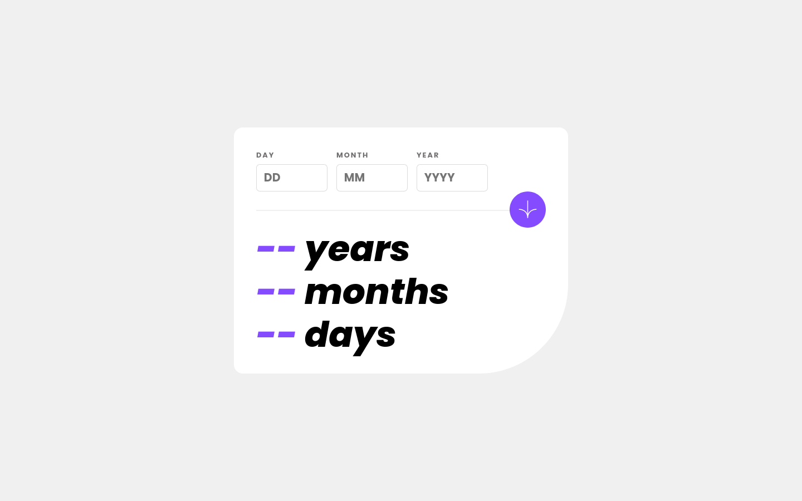

# Frontend Mentor - Age calculator app solution

This is a solution to the [Age calculator app challenge on Frontend Mentor](https://www.frontendmentor.io/challenges/age-calculator-app-dF9DFFpj-Q). Frontend Mentor challenges help you improve your coding skills by building realistic projects.

## Table of contents

- [Overview](#overview)
  - [The challenge](#the-challenge)
  - [Screenshot](#screenshot)
  - [Links](#links)
- [My process](#my-process)
  - [Built with](#built-with)
  - [What I learned](#what-i-learned)
  - [Continued development](#continued-development)
  - [Useful resources](#useful-resources)
- [Author](#author)

## Overview

### The challenge

Users should be able to:

- View an age in years, months, and days after submitting a valid date through the form
- Receive validation errors if:
  - Any field is empty when the form is submitted
  - The day number is not between 1-31
  - The month number is not between 1-12
  - The year is in the future
  - The date is invalid e.g. 31/04/1991 (there are 30 days in April)
- View the optimal layout for the interface depending on their device's screen size
- See hover and focus states for all interactive elements on the page
- **Bonus**: See the age numbers animate to their final number when the form is submitted

### Screenshot

### Links

- Solution URL: [My Solution](https://www.frontendmentor.io/solutions/age-calculator-app-mb-R781dtqyHT)
- Live Site URL: [Live](https://matiasbastarrica.github.io/age-calculator-app/)

## My process

### Built with

- Semantic HTML5 markup
- CSS custom properties
- Flexbox
- CSS Grid
- Mobile-first workflow
- JavaScript

### What I learned

I learned to use the Constraint validation API to handle the display of different validation errors.

### Continued development

In the future I'd like to keep working on form validation

### Useful resources

- [ValidityState](https://developer.mozilla.org/en-US/docs/Web/API/ValidityState) - This helped me for displaying different error messages based on different invalid states of the inputs. I really liked this pattern and will use it going forward.

## Author

- Frontend Mentor - [@MatiasBastarrica](https://www.frontendmentor.io/profile/yourusername)
